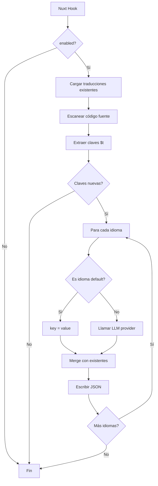

# nuxt-auto-translate

Módulo de Nuxt que automatiza traducciones i18n usando LLMs (OpenAI, Anthropic, Gemini, Groq, Ollama).

> **Estado**: Módulo npm publicable. Ubicación: `packages/nuxt-auto-translate/`

---

## Descripción General

### Qué hace

1. Escanea archivos `.vue`, `.js`, `.ts` en carpetas específicas
2. Extrae todas las llamadas a `$t("texto")` usando regex
3. Compara con traducciones existentes (cache)
4. Traduce claves nuevas usando el provider configurado
5. Escribe los archivos JSON de traducciones

### Cuándo se ejecuta

| Evento          | Condición             | Acción                                  |
| --------------- | --------------------- | --------------------------------------- |
| `build:before`  | `enabled: true`       | Traduce antes del build                 |
| `builder:watch` | `enabled: true`       | Traduce al detectar cambios en archivos |

### Providers de traducción

| Provider | Modelo Default | Características |
|----------|----------------|-----------------|
| **OpenAI** | `gpt-4o-mini` | Mejor calidad, batching, pago por uso |
| **Anthropic** | `claude-3-5-haiku-20241022` | Alta calidad, rápido |
| **Gemini** | `gemini-2.0-flash-exp` | Plan gratuito disponible |
| **Groq** | `llama-3.3-70b-versatile` | Muy rápido, plan gratuito |
| **Ollama** | `llama3.2` | 100% privado, offline, gratuito |

---

## Instalación

```bash
# Instalar el módulo
pnpm add nuxt-auto-translate

# Instalar el SDK del provider que uses (solo uno)
pnpm add openai                    # OpenAI o Groq o Ollama
pnpm add @anthropic-ai/sdk         # Anthropic
pnpm add @google/generative-ai     # Gemini
```

## Configuración

### nuxt.config.ts

```typescript
export default defineNuxtConfig({
  modules: ['nuxt-auto-translate'],

  autoTranslate: {
    enabled: true,
    provider: 'openai',
    defaultLocale: 'es',
    locales: [
      { code: 'es', name: 'Español' },
      { code: 'en', name: 'English' },
    ],
    outputPath: 'public/i18n',      // Donde guardar los JSON
    backupPath: 'i18n/backups',     // Backups antes de limpiar
    cleanOrphaned: true,            // Limpiar traducciones no usadas
    backupBeforeClean: true,
    maxBackups: 3,
  },
})
```

### Opciones completas

| Opción | Tipo | Default | Descripción |
|--------|------|---------|-------------|
| `enabled` | `boolean` | `false` | Activa/desactiva el módulo |
| `provider` | `string` | `'openai'` | Provider de traducción |
| `defaultLocale` | `string` | `'es'` | Idioma fuente |
| `locales` | `LocaleConfig[]` | `[]` | Lista de idiomas destino |
| `outputPath` | `string` | `'i18n/locales'` | Ruta de salida para JSON |
| `backupPath` | `string` | - | Ruta para backups |
| `targetFolders` | `string[]` | `['components', ...]` | Carpetas a escanear |
| `rootFiles` | `string[]` | `[]` | Archivos raíz (ej: `app.vue`) |
| `fileExtensions` | `string[]` | `['.vue', '.ts', '.js']` | Extensiones a escanear |
| `enableCache` | `boolean` | `true` | Solo traducir claves nuevas |
| `cleanOrphaned` | `boolean` | `false` | Eliminar traducciones huérfanas |
| `backupBeforeClean` | `boolean` | `true` | Backup antes de limpiar |
| `maxBackups` | `number` | `3` | Máximo backups por idioma |

---

## Variables de Entorno

```bash
# Seleccionar provider
NUXT_AUTO_TRANSLATE_PROVIDER=openai

# OpenAI
NUXT_AUTO_TRANSLATE_OPENAI_KEY=sk-xxxxx
NUXT_AUTO_TRANSLATE_OPENAI_MODEL=gpt-4o-mini

# Anthropic Claude
NUXT_AUTO_TRANSLATE_ANTHROPIC_KEY=sk-ant-xxxxx
NUXT_AUTO_TRANSLATE_ANTHROPIC_MODEL=claude-3-5-haiku-20241022

# Google Gemini
NUXT_AUTO_TRANSLATE_GEMINI_KEY=AIzaSyxxxxx
NUXT_AUTO_TRANSLATE_GEMINI_MODEL=gemini-2.0-flash-exp

# Groq
NUXT_AUTO_TRANSLATE_GROQ_KEY=gsk_xxxxx
NUXT_AUTO_TRANSLATE_GROQ_MODEL=llama-3.3-70b-versatile

# Ollama / LM Studio (no requiere API key)
NUXT_AUTO_TRANSLATE_OLLAMA_MODEL=llama3.2
NUXT_AUTO_TRANSLATE_OLLAMA_BASE_URL=http://localhost:11434/v1
```

---

## Arquitectura

### Diagrama de Flujo



### Estructura del Módulo

```
packages/nuxt-auto-translate/
├── src/
│   ├── module.ts                 # defineNuxtModule
│   ├── types.ts                  # Tipos públicos
│   ├── index.ts                  # Exportaciones
│   └── core/
│       ├── translate.ts          # Función principal
│       ├── providers/
│       │   ├── openai.provider.ts
│       │   ├── anthropic.provider.ts
│       │   ├── gemini.provider.ts
│       │   ├── groq.provider.ts
│       │   └── ollama.provider.ts
│       ├── services/
│       │   ├── scanner.service.ts    # Escaneo de $t()
│       │   ├── translator.service.ts # Orquestación
│       │   └── file.service.ts       # I/O de archivos
│       └── utils/
│           ├── logger.ts
│           └── validators.ts
├── playground/                   # App de prueba
├── docs/                         # Documentación
├── package.json
└── README.md
```

---

## Uso en Componentes

```vue
<template>
  <!-- Uso directo en template -->
  <h1>{{ $t("Título de la página") }}</h1>

  <!-- Con variables (no se traducen las llaves) -->
  <p>{{ $t("Hola {name}, tienes {count} mensajes") }}</p>

  <!-- Con HTML (se preserva) -->
  <span>{{ $t('Texto <strong>importante</strong>') }}</span>
</template>

<script setup lang="ts">
// Uso en script
const { t: $t } = useI18n();

const message = computed(() => $t("Mensaje dinámico"));
</script>
```

### Regex de Extracción

```typescript
// Detecta: $t("texto"), $t('texto'), $t(`texto`)
const regex = /\$t\(\s*(?:"((?:[^"\\]|\\.)*?)"|'((?:[^'\\]|\\.)*?)'|`((?:[^`]|\\.)*?)`)[^)]*\)/g;
```

---

## Migración desde Sistema Anterior

Si usabas el sistema anterior con `config/hooks/auto-translate/`:

### 1. Instalar el módulo

```bash
pnpm add nuxt-auto-translate
```

### 2. Actualizar nuxt.config.ts

```typescript
export default defineNuxtConfig({
  modules: ['nuxt-auto-translate'],

  autoTranslate: {
    enabled: process.env.NUXT_AUTO_TRANSLATE_ENABLED === 'true',
    provider: 'openai',
    defaultLocale: 'es',
    locales: [
      { code: 'es', name: 'Español' },
      { code: 'en', name: 'English' },
    ],
    outputPath: 'public/i18n',
  },
})
```

### 3. Actualizar variables de entorno

```bash
# Antes (NUXT_I18N_*)
NUXT_I18N_AUTO_TRANSLATE=true
NUXT_I18N_TRANSLATION_PROVIDER=openai
NUXT_I18N_OPENAI_KEY=sk-xxx

# Después (NUXT_AUTO_TRANSLATE_*)
NUXT_AUTO_TRANSLATE_ENABLED=true
NUXT_AUTO_TRANSLATE_PROVIDER=openai
NUXT_AUTO_TRANSLATE_OPENAI_KEY=sk-xxx
```

### 4. Eliminar código antiguo

```bash
# Eliminar carpeta de hooks
rm -rf config/hooks/auto-translate/

# Simplificar config/hooks.ts (si ya no tiene otros hooks, eliminarlo)
```

---

## Comparación de Providers

| Provider | Costo | Velocidad | Offline | Mejor Para |
|----------|-------|-----------|---------|------------|
| **OpenAI** | $$ | Rápido | No | Producción, máxima calidad |
| **Anthropic** | $$ | Rápido | No | Producción alternativa |
| **Gemini** | $ | Rápido | No | Presupuesto limitado |
| **Groq** | Gratis | Muy rápido | No | Velocidad + economía |
| **Ollama** | Gratis | Variable* | Sí | Desarrollo, privacidad |

*Ollama depende del hardware local

---

## Desarrollo del Módulo

```bash
cd packages/nuxt-auto-translate

# Instalar dependencias
pnpm install

# Preparar para desarrollo
pnpm run dev:prepare

# Desarrollar con playground
pnpm run dev

# Compilar
pnpm run prepack

# Tests
pnpm run test
```

---

## Roadmap

- [x] ~~Centralizar código en módulo Nuxt~~ (Completado)
- [ ] CLI para gestión manual (`translate:sync`, `translate:check`)
- [ ] Cache persistente entre builds
- [ ] Soporte para pluralización automática
- [ ] Dashboard de traducciones pendientes
